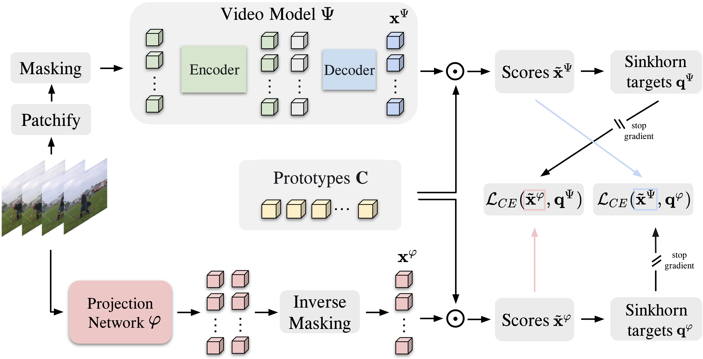

# Official PyTorch Implementation of SIGMA(ECCV 2024).




<!-- [](https://huggingface.co/models?other=videomae)[](https://huggingface.co/spaces/sayakpaul/video-classification-ucf101-subset)[](https://colab.research.google.com/github/huggingface/notebooks/blob/main/examples/video_classification.ipynb)<br>
[](https://paperswithcode.com/sota/action-recognition-in-videos-on-something?p=videomae-masked-autoencoders-are-data-1)<br>
[](https://paperswithcode.com/sota/action-classification-on-kinetics-400?p=videomae-masked-autoencoders-are-data-1)<br>[](https://paperswithcode.com/sota/action-recognition-on-ava-v2-2?p=videomae-masked-autoencoders-are-data-1)<br>
[](https://paperswithcode.com/sota/self-supervised-action-recognition-on-ucf101?p=videomae-masked-autoencoders-are-data-1)<br>
[](https://paperswithcode.com/sota/self-supervised-action-recognition-on-hmdb51?p=videomae-masked-autoencoders-are-data-1) --> 

<!-- > [**VideoMAE V2: Scaling Video Masked Autoencoders with Dual Masking**](https://arxiv.org/abs/2303.16727)<br>
> [Limin Wang](http://wanglimin.github.io/), [Bingkun Huang](https://github.com/congee524), [Zhiyu Zhao](https://github.com/JerryFlymi), [Zhan Tong](https://github.com/yztongzhan), Yinan He, Yi Wang, Yali Wang, Yu Qiao <br>Nanjing University, Shanghai AI Lab, CAS

> [**VideoMAE: Masked Autoencoders are Data-Efficient Learners for Self-Supervised Video Pre-Training**](https://arxiv.org/abs/2203.12602)<br>
> [Zhan Tong](https://github.com/yztongzhan), [Yibing Song](https://ybsong00.github.io/), [Jue Wang](https://juewang725.github.io/), [Limin Wang](http://wanglimin.github.io/)<br>Nanjing University, Tencent AI Lab -->

<!-- ## 📰 News
**[2023.4.3]** VideoMAE V2 is accepted by **CVPR 2023**! 🎉 Code comming soon. <br>
**[2023.1.16]** Code and pre-trained models for Action Detection are [available](https://github.com/MCG-NJU/VideoMAE-Action-Detection)! <br>
**[2022.11.20]** 👀 VideoMAE is integrated into [](https://huggingface.co/spaces/sayakpaul/video-classification-ucf101-subset) and [](https://colab.research.google.com/github/huggingface/notebooks/blob/main/examples/video_classification.ipynb), supported by [@Sayak Paul](https://github.com/sayakpaul).<br>
**[2022.10.25]** 👀 VideoMAE is integrated into [MMAction2](https://github.com/open-mmlab/mmaction2/tree/dev-1.x/configs/recognition/videomae), the results  on Kinetics-400 can be reproduced successfully. <br>
**[2022.10.20]** The pre-trained models and scripts of **ViT-S** and **ViT-H** are available! <br>
**[2022.10.19]** The pre-trained models and scripts on **UCF101** are [available](MODEL_ZOO.md#UCF101)! <br>
**[2022.9.15]** VideoMAE is accepted by **NeurIPS 2022** as a **spotlight** presentation! 🎉 <br>
**[2022.8.8]** 👀 VideoMAE is integrated into **official** [🤗HuggingFace Transformers](https://huggingface.co/docs/transformers/main/en/model_doc/videomae) now! [](https://huggingface.co/models?other=videomae)<br>
**[2022.7.7]**  We have updated new results on downstream AVA 2.2 benchmark. Please refer to our [paper](https://arxiv.org/abs/2203.12602) for details. <br>
**[2022.4.24]**  Code and pre-trained models are available now! <br>
**[2022.3.24]** ~~Code and pre-trained models will be released here.~~ Welcome to **watch** this repository for the latest updates. -->

<!-- ## ✨ Highlights -->

### 🔥 Sinkhorn-Guided Masked Video Modeling

Video-based pretraining offers immense potential for learning strong visual representations on an unprecedented scale. Recently, masked video modeling methods have shown promising scalability, yet fall short in capturing higher-level semantics due to reconstructing predefined low-level targets such as pixels. To tackle this, we present Sinkhorn-guided Masked Video Modelling (SIGMA), a novel video pretraining method that jointly learns the video model in addition to a target feature space using a projection network. However, this simple modification means that the regular L2 reconstruction loss will lead to trivial solutions as both networks are jointly optimized. As a solution, we distribute features of space-time tubes evenly across a limited number of learnable clusters. By posing this as an optimal transport problem, we enforce high entropy in the generated features across the batch, infusing semantic and temporal meaning into the feature space. The resulting cluster assignments are used as targets for a symmetric prediction task where the video model predicts cluster assignment of the projection network and vice versa. Experimental results on ten datasets across three benchmarks validate the effectiveness of SIGMA in learning more performant, temporally-aware, and robust video representations improving upon state-of-the-art methods.

<!-- ### ⚡️ A Simple, Efficient and Strong Baseline in SSVP

VideoMAE uses the simple masked autoencoder and **plain ViT** backbone to perform video self-supervised learning. Due to the extremely high masking ratio, the pre-training time of VideoMAE is **much shorter** than contrastive learning methods (**3.2x** speedup). VideoMAE can serve as **a simple but strong baseline** for future research in self-supervised video pre-training.

### 😮 High performance, but NO extra data required

VideoMAE works well for video datasets of different scales and can achieve **87.4%** on Kinects-400, **75.4%** on Something-Something V2, **91.3%** on UCF101, and **62.6%** on HMDB51. To our best knowledge, VideoMAE is the **first** to achieve the state-of-the-art performance on these four popular benchmarks with the **vanilla ViT** backbones while **doesn't need** any extra data or pre-trained models.

<!-- ## 🚀 Main Results -->

### ✨ Something-Something V2

|  Method  | Extra Data | Backbone | Resolution | #Frames x Clips x Crops | Epoch | Top-1 |
| :------: | :--------: | :------: | :--------: | :---------------------: | :---: | :---: |
| VideoMAE |  ***no***  |  ViT-S   |  224x224   |         16x2x3          | 2400  | 66.8  |
| VideoMAE |  ***no***  |  ViT-B   |  224x224   |         16x2x3          | 800   | 69.6  |
| SIGMA    |***Img-1k***|  ViT-S   |  224x224   |         16x2x3          | 2400  | 68.6  |
| SIGMA    |***Img-1k***|  ViT-B   |  224x224   |         16x2x3          | 800   | 70.9  |

### ✨ Kinetics-400


|  Method  | Extra Data | Backbone | Resolution | #Frames x Clips x Crops | Epoch | Top-1 |
| :------: | :--------: | :------: | :--------: | :---------------------: | :---: | :---: |
| VideoMAE |  ***no***  |  ViT-S   |  224x224   |         16x5x3          |  1600 | 79.0  |
| VideoMAE |  ***no***  |  ViT-B   |  224x224   |         16x5x3          |  800  | 80.0  |
| SIGMA    |***Img-1k***|  ViT-S   |  224x224   |         16x5x3          |  800  | 79.4  |
| SIGMA    |***Img-1k***|  ViT-B   |  224x224   |         16x5x3          |  800  | 81.6  |


<!-- |  Method  | Extra Data | Backbone | Resolution | #Frames x Clips x Crops | Top-1 | Top-5 |
| :------: | :--------: | :------: | :--------: | :---------------------: | :---: | :---: |
| VideoMAE |  ***no***  |  ViT-S   |  224x224   |         16x5x3          | 79.0  | 93.8  |
| VideoMAE |  ***no***  |  ViT-B   |  224x224   |         16x5x3          | 81.5  | 95.1  |
| VideoMAE |  ***no***  |  ViT-L   |  224x224   |         16x5x3          | 85.2  | 96.8  |
| VideoMAE |  ***no***  |  ViT-H   |  224x224   |         16x5x3          | 86.6  | 97.1  |
| VideoMAE |  ***no***  |  ViT-L   |  320x320   |         32x4x3          | 86.1  | 97.3  |
| VideoMAE |  ***no***  |  ViT-H   |  320x320   |         32x4x3          | 87.4  | 97.6  | -->

<!-- ### ✨ AVA 2.2

Please check the code and checkpoints in [VideoMAE-Action-Detection](https://github.com/MCG-NJU/VideoMAE-Action-Detection).
|  Method  |  Extra Data  | Extra Label | Backbone | #Frame x Sample Rate | mAP  |
| :------: | :----------: | :---------: | :------: | :------------------: | :--: |
| VideoMAE | Kinetics-400 |   &cross;   |  ViT-S   |         16x4         | 22.5 |
| VideoMAE | Kinetics-400 |   &check;   |  ViT-S   |         16x4         | 28.4 |
| VideoMAE | Kinetics-400 |   &cross;   |  ViT-B   |         16x4         | 26.7 |
| VideoMAE | Kinetics-400 |   &check;   |  ViT-B   |         16x4         | 31.8 |
| VideoMAE | Kinetics-400 |   &cross;   |  ViT-L   |         16x4         | 34.3 |
| VideoMAE | Kinetics-400 |   &check;   |  ViT-L   |         16x4         | 37.0 |
| VideoMAE | Kinetics-400 |   &cross;   |  ViT-H   |         16x4         | 36.5 |
| VideoMAE | Kinetics-400 |   &check;   |  ViT-H   |         16x4         | 39.5 |
| VideoMAE | Kinetics-700 |   &cross;   |  ViT-L   |         16x4         | 36.1 |
| VideoMAE | Kinetics-700 |   &check;   |  ViT-L   |         16x4         | 39.3 | -->

<!-- ### ✨ UCF101 & HMDB51

|  Method  |  Extra Data  | Backbone | UCF101 | HMDB51 |
| :------: | :----------: | :------: | :----: | :----: |
| VideoMAE |   ***no***   |  ViT-B   |  91.3  |  62.6  |
| VideoMAE | Kinetics-400 |  ViT-B   |  96.1  |  73.3  | -->

## 🔨 Installation

Please follow the instructions in [INSTALL.md](INSTALL.md).

## ➡️ Data Preparation

Please follow the instructions in [DATASET.md](DATASET.md) for data preparation.

## 🔄 Pre-training

The pre-training instruction is in [PRETRAIN.md](PRETRAIN.md).
You can find our models on Huggingface(https://huggingface.co/SMSD75/SIGMA)

## ⤴️ Fine-tuning with pre-trained models

The fine-tuning instruction is in [FINETUNE.md](FINETUNE.md).

## 📍Model Zoo


## ⚠️ Our code is based on [VideoMAE](https://github.com/MCG-NJU/VideoMAE) code base. 

## ✏️ Citation

If you think this project is helpful, please feel free to leave a star⭐️ and cite our paper:

```

@article{salehi2024sigma,
  title={SIGMA: Sinkhorn-Guided Masked Video Modeling},
  author={Salehi, Mohammadreza and Dorkenwald, Michael and Thoker, Fida Mohammad and Gavves, Efstratios and Snoek, Cees GM and Asano, Yuki M},
  journal={European Conference of Computer Vision},
  year={2024}
}

```
``` -->
